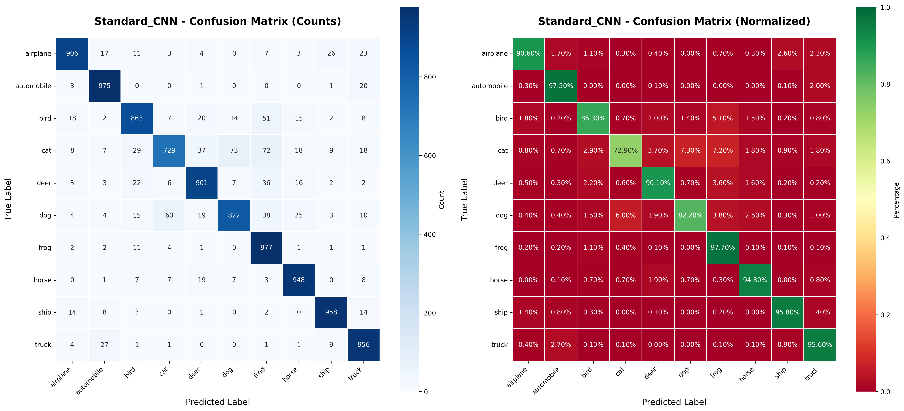
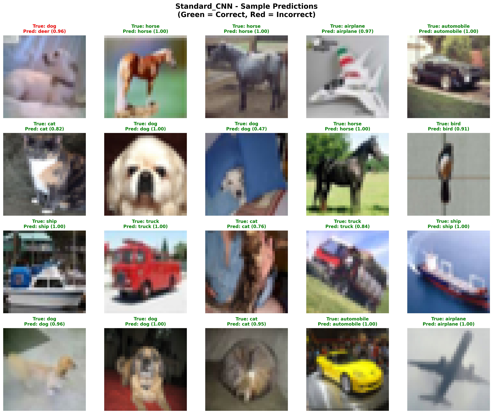
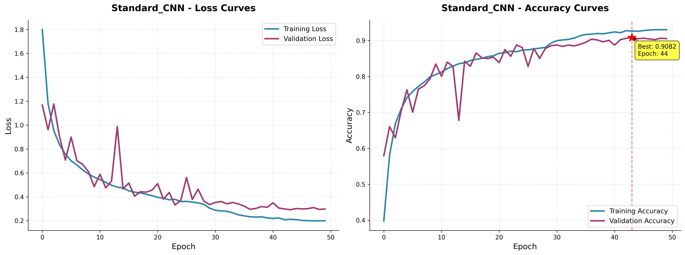

# CV Exam Project Structure

This README provides an overview of all folders and files in the current directory (`c:/Users/user/Desktop/CV Exam`). This project appears to be a Computer Vision (CV) exam assignment with deliverables organized by question, covering data exploration, model training, backend API, and frontend application for image classification (likely CIFAR-10 dataset).

## Overview
- **Question 1**: Data exploration and preprocessing.
- **Question 2**: CNN model training, evaluation, and artifacts.
- **Question 3**: FastAPI backend for model predictions with authentication, rate limiting, and logging.
- **Question 4**: Frontend web application for uploading images and displaying predictions.

## Root Directory Files
These are likely shared or additional files:
- main.py: Main script (possibly backend entry point).
- index.html: HTML file for frontend.
- style.css: CSS styling for the web app.
- script.js: JavaScript for frontend functionality.
- model_loader.py: Script to load the trained model.
- preprocessing.py: Data preprocessing utilities.
- db.py: Database interaction (e.g., SQLite for logging predictions).
- auth.py: Authentication module.
- rate_limiter.py: Rate limiting implementation.
- requirements.txt: Python dependencies.
- README.md: This file.

## Directories

### __pycache__/
- (Python bytecode cache files - typically auto-generated)

### .git/
- (Git repository metadata - typically auto-generated)

### Question_1_Deliverables/
Data exploration and preprocessing deliverables.
- 01_data_exploration.ipynb: Jupyter notebook for exploring the CIFAR-10 dataset.
- data_preprocessing.py: Python script for data preprocessing steps.

### Question_2_Deliverables/
CNN model training and evaluation deliverables.
- 02_model_training.ipynb: Jupyter notebook for training the Standard CNN model on CIFAR-10.
- best_Standard_CNN.h5: Saved trained model weights.
- Standard_CNN_confusion_matrix.png: Confusion matrix visualization.
  
- Standard_CNN_sample_predictions.png: Sample prediction images.
  
- Standard_CNN_training_curves.png: Training loss and accuracy curves.
  
- Standard_CNN_training_history.json: JSON file with training history data.

### Question_3_Deliverables/
FastAPI backend for CIFAR-10 CNN predictions. Provides endpoints for health checks, single/batch image predictions, with API key authentication, rate limiting, and SQLite logging.
- auth.py: Authentication utilities.
- best_Standard_CNN.h5: Trained model (same as Question 2).
- db.py: Database operations for logging predictions.
- main.py: FastAPI application entry point.
- model_loader.py: Model loading script.
- predictions.db: SQLite database for prediction logs.
- preprocessing.py: Image preprocessing for predictions.
- rate_limiter.py: In-memory rate limiter (not suitable for distributed deployments).
- README.md: Detailed backend documentation (see below for excerpt).
- requirements.txt: Dependencies (e.g., FastAPI, TensorFlow, etc.).

**Excerpt from Question_3_Deliverables/README.md:**
This backend serves a CNN trained on CIFAR-10. It provides endpoints to predict a single image or batch of images, health checks, rate limiting and simple API key authentication, and logs predictions to a SQLite DB.

Setup: Create virtual env, install requirements, set API key, run with uvicorn.

Endpoints:
- GET /health: Returns status and model loaded.
- POST /predict: Multipart form-data with file, returns predicted class, confidence, and full predictions map.
- POST /predict/batch: Multipart with multiple files.

Authentication: Use header X-API-KEY: dev-key-123 (replace in production).

Notes: Rate limiting is in-memory (use Redis for production). SQLite logging is synchronous (use async DB for production).

### Question_4_Deliverables/
Frontend web application for image classification.
- frontend photo.PNG: Screenshot or photo of the frontend interface.
  
- index.html: Main HTML page.
- script.js: JavaScript for handling uploads and API calls.
- style.css: CSS for styling the web app.
